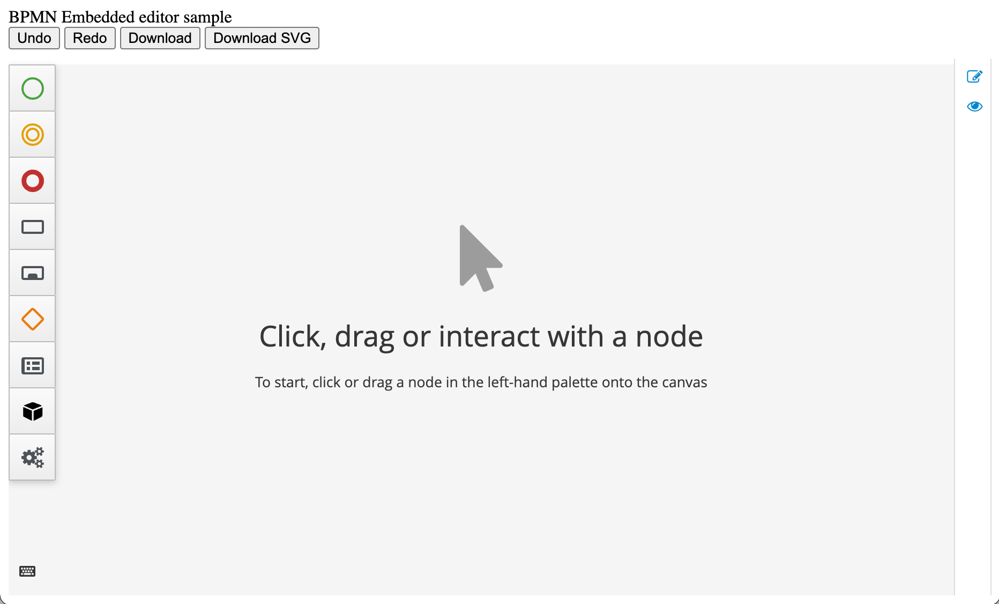

# EmbeddedBpmnEditor
Example of Embedded Bpmn Editor.

## Sample contains:
* Latest upstream release Embedded Editor
* Buttons to interact with BPMN Editor through editor API
* Changed/Unchanged status
* Integrated Work Item Definition (WID)
