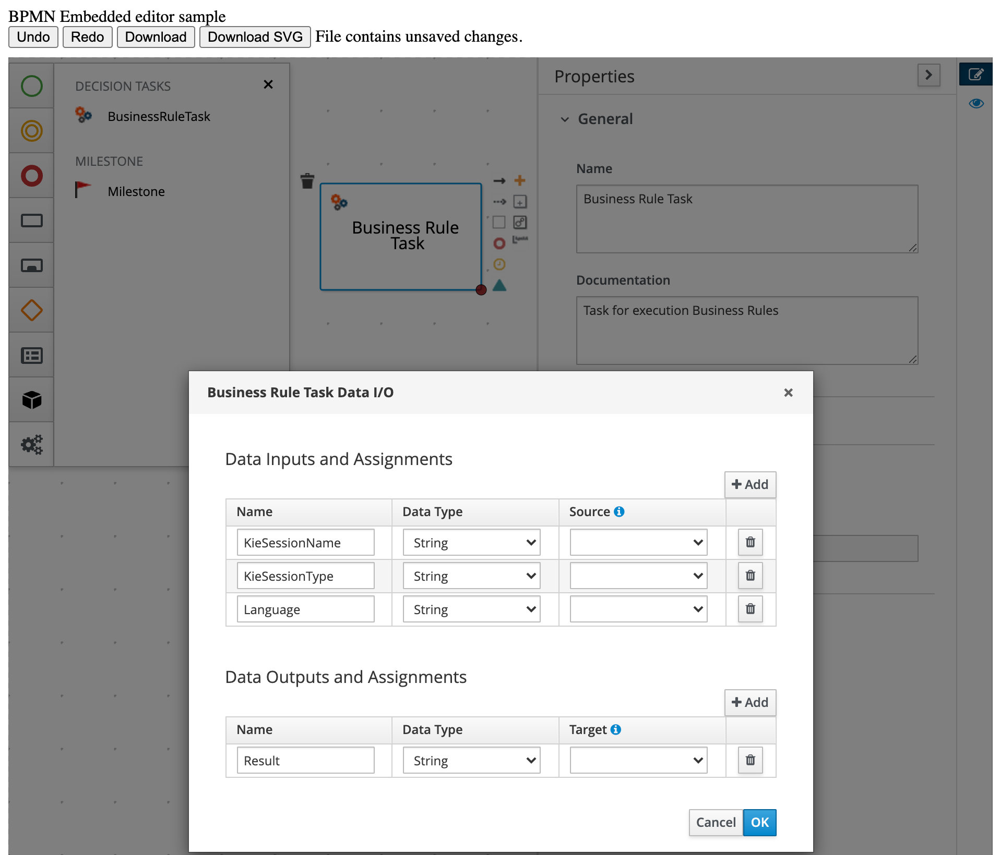

# EmbeddedBpmnEditor
Example of Embedded Bpmn Editor.

## Sample contains:
* Full sample 
* Buttons to interact with BPMN Editor through editor API
* Changed/Unchanged status
* Integrated Work Item Definition (WID)
  * All currently supported parameters
  * WID icon in base 64 format
  * Embedded Milestone WID doesn't require to be declared
  

